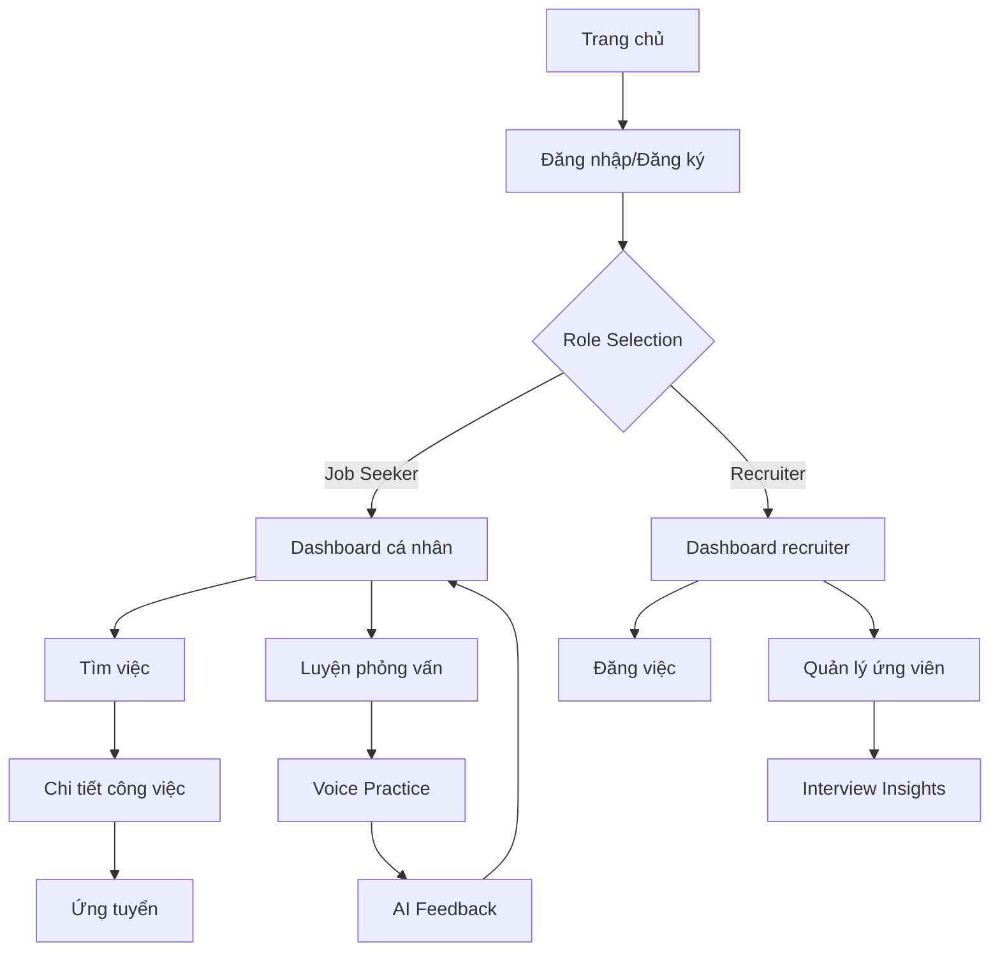

# Job Recruitment & Interview Prep Platform - Product Requirements Document

## 1. Product Overview

Nền tảng tuyển dụng và luyện tập phỏng vấn tích hợp AI voice analysis, giúp ứng viên cải thiện kỹ năng phỏng vấn và kết nối với nhà tuyển dụng một cách hiệu quả.

- Giải quyết vấn đề: Thiếu kỹ năng phỏng vấn của ứng viên và khó khăn trong việc tìm kiếm, đánh giá ứng viên phù hợp của nhà tuyển dụng.
- Mục tiêu thị trường: Phục vụ 1000+ users với chi phí vận hành $0-20/tháng, tập trung vào thị trường Việt Nam.

## 2. Core Features

### 2.1 User Roles

| Role | Registration Method | Core Permissions |
|------|---------------------|------------------|
| Job Seeker | Email registration + profile setup | Tìm việc, luyện phỏng vấn, xem analytics cá nhân |
| Recruiter | Business email verification + company info | Đăng việc, xem candidate profiles, truy cập interview analytics |
| Admin | Invitation-only | Quản lý platform, moderate content, system analytics |

### 2.2 Feature Module

Nền tảng bao gồm các trang chính sau:

1. **Trang chủ**: Hero section, job search bar, featured jobs, platform statistics
2. **Trang tìm việc**: Job listings, advanced filters, saved jobs, application tracking
3. **Trang chi tiết công việc**: Job description, company info, apply button, similar jobs
4. **Trang luyện phỏng vấn**: Voice practice interface, AI feedback, progress tracking
5. **Dashboard cá nhân**: Profile management, application history, skill analytics
6. **Dashboard recruiter**: Job management, candidate pipeline, interview insights
7. **Trang đăng nhập/đăng ký**: Authentication forms, role selection

### 2.3 Page Details

| Page Name | Module Name | Feature description |
|-----------|-------------|---------------------|
| Trang chủ | Hero Section | Display platform value proposition, job search bar, call-to-action buttons |
| Trang chủ | Featured Jobs | Show trending jobs, location-based recommendations, quick apply options |
| Trang chủ | Statistics | Display user count, successful placements, platform metrics |
| Tìm việc | Job Listings | CRUD operations, pagination, real-time updates, bookmark functionality |
| Tìm việc | Search & Filter | Advanced search by title/company/location/salary, tag-based filtering, saved searches |
| Chi tiết công việc | Job Details | Complete job description, requirements, benefits, company profile |
| Chi tiết công việc | Application | One-click apply, cover letter upload, application status tracking |
| Luyện phỏng vấn | Voice Practice | Real-time voice recording, ViWhisper transcription, AI analysis (pace, pitch, tone) |
| Luyện phỏng vấn | AI Feedback | Speech quality scoring, improvement suggestions, practice recommendations |
| Luyện phỏng vấn | Progress Tracking | Historical performance, skill improvement charts, achievement badges |
| Dashboard cá nhân | Profile Management | Personal info, resume upload, skill tags, portfolio links |
| Dashboard cá nhân | Application History | Applied jobs status, interview schedules, feedback received |
| Dashboard cá nhân | Analytics | Interview performance metrics, skill development graphs, recommendations |
| Dashboard recruiter | Job Management | Create/edit/delete job posts, application management, candidate screening |
| Dashboard recruiter | Candidate Pipeline | Applicant tracking, interview scheduling, evaluation forms |
| Dashboard recruiter | Interview Insights | Candidate voice analysis results, hiring recommendations, team collaboration |
| Đăng nhập/Đăng ký | Authentication | Secure login/register, role-based access, password recovery, social login |

## 3. Core Process

**Job Seeker Flow:**
Người dùng đăng ký → Hoàn thiện profile → Tìm kiếm việc làm → Luyện tập phỏng vấn với AI → Ứng tuyển → Theo dõi tiến độ → Nhận feedback

**Recruiter Flow:**
Nhà tuyển dụng đăng ký → Xác thực doanh nghiệp → Đăng tin tuyển dụng → Quản lý ứng viên → Xem phân tích AI về ứng viên → Lên lịch phỏng vấn → Đưa ra quyết định tuyển dụng

**Voice Training Flow:**
Chọn chủ đề phỏng vấn → Ghi âm câu trả lời → AI phân tích (ViWhisper + voice metrics) → Nhận feedback chi tiết → Lưu kết quả → Theo dõi tiến bộ

## 4. User Interface Design

### 4.1 Design Style

- **Primary Colors**: #2563eb (Blue 600), #1e40af (Blue 700)
- **Secondary Colors**: #f8fafc (Slate 50), #64748b (Slate 500)
- **Accent Colors**: #10b981 (Emerald 500), #f59e0b (Amber 500)
- **Button Style**: Rounded corners (8px), subtle shadows, hover animations
- **Typography**: Inter font family, 14px base size, 16px for body text
- **Layout Style**: Card-based design, clean spacing, top navigation with sidebar
- **Icons**: Lucide React icons, consistent 20px size, outline style

### 4.2 Page Design Overview

| Page Name | Module Name | UI Elements |
|-----------|-------------|-------------|
| Trang chủ | Hero Section | Gradient background (#2563eb to #1e40af), centered content, large search bar, CTA buttons with hover effects |
| Trang chủ | Featured Jobs | Card grid layout, company logos, salary badges, location tags, bookmark icons |
| Tìm việc | Job Listings | List/grid toggle, filter sidebar, infinite scroll, skeleton loading states |
| Tìm việc | Search & Filter | Sticky search bar, collapsible filter panels, tag chips, clear filters button |
| Luyện phỏng vấn | Voice Practice | Waveform visualization, record button with pulse animation, progress indicators |
| Luyện phỏng vấn | AI Feedback | Score circles, improvement charts, color-coded metrics (green/yellow/red) |
| Dashboard | Analytics | Interactive charts (Chart.js), progress bars, achievement cards, trend indicators |

### 4.3 Responsiveness

- **Desktop-first approach** với breakpoints: sm (640px), md (768px), lg (1024px), xl (1280px)
- **Mobile optimization**: Touch-friendly buttons (44px minimum), swipe gestures, bottom navigation
- **Voice interface**: Optimized for mobile recording, noise cancellation indicators, accessibility features