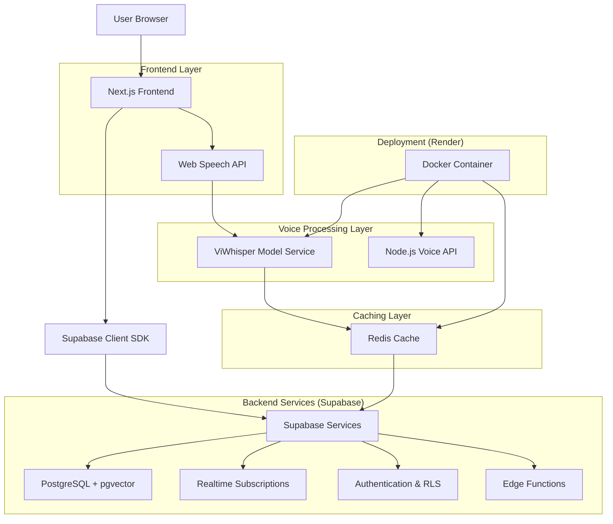
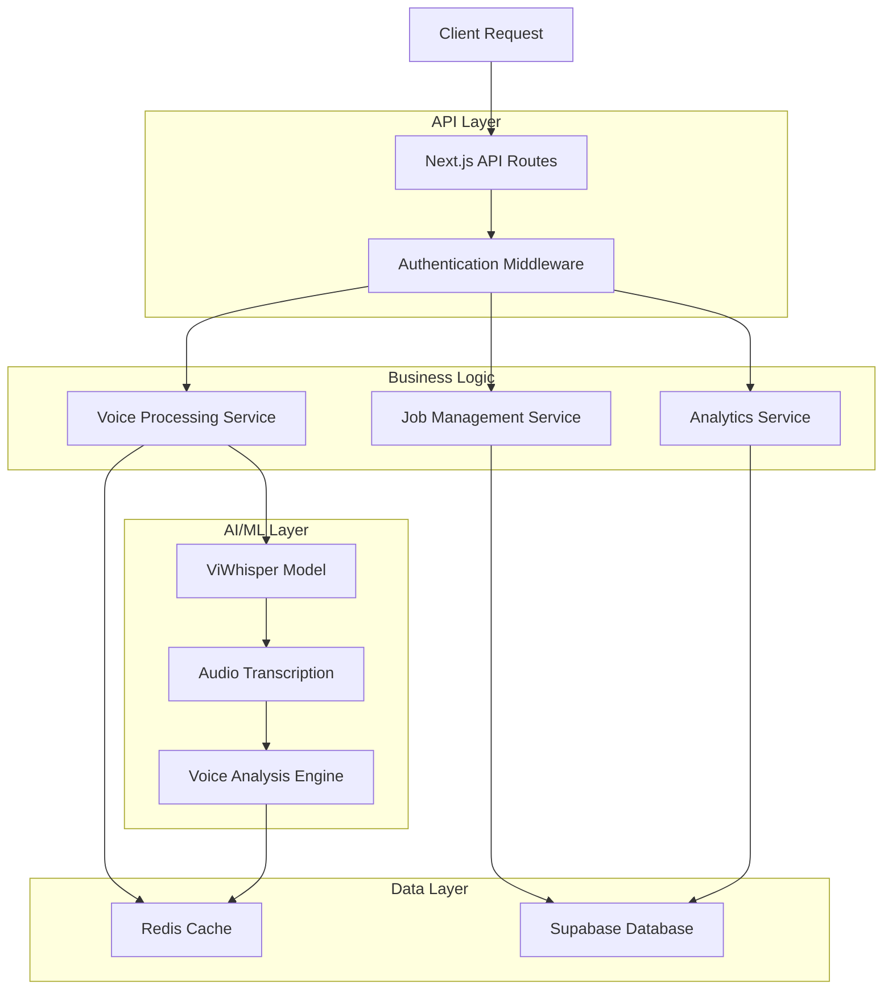
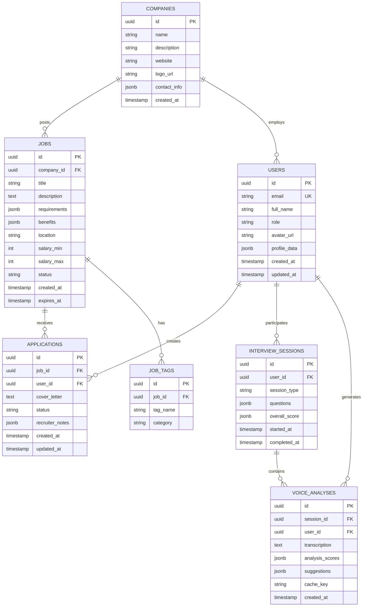

# Job Recruitment & Interview Prep Platform - Technical Architecture Document

## 1. Architecture Design



## 2. Technology Description

* **Frontend**: Next.js\@14 + shadcn/ui + Tailwind CSS + TypeScript

* **Backend**: Supabase (PostgreSQL + pgvector + Realtime + Auth + RLS)

* **Voice Processing**: ViWhisper-medium model + Node.js/Express API

* **Caching**: Redis for voice analysis results and job search

* **Deployment**: Docker containers on Render platform

* **AI/ML**: PyTorch + Hugging Face Transformers (ViWhisper integration)

## 3. Route Definitions

| Route                 | Purpose                                  |
| --------------------- | ---------------------------------------- |
| /                     | Trang chủ với hero section và job search |
| /auth/login           | Đăng nhập với Supabase Auth              |
| /auth/register        | Đăng ký tài khoản với role selection     |
| /jobs                 | Danh sách việc làm với search và filter  |
| /jobs/\[id]           | Chi tiết công việc và ứng tuyển          |
| /interview-practice   | Giao diện luyện tập phỏng vấn voice      |
| /dashboard            | Dashboard cá nhân cho job seekers        |
| /recruiter/dashboard  | Dashboard cho recruiters                 |
| /recruiter/jobs       | Quản lý job posts                        |
| /recruiter/candidates | Pipeline ứng viên                        |
| /profile              | Quản lý profile và settings              |
| /analytics            | Phân tích performance phỏng vấn          |

## 4. API Definitions

### 4.1 Core API

**Voice Analysis API**

```
POST /api/voice/analyze
```

Request:

| Param Name | Param Type | isRequired | Description                  |
| ---------- | ---------- | ---------- | ---------------------------- |
| audioBlob  | Blob       | true       | Audio data từ Web Speech API |
| questionId | string     | true       | ID của câu hỏi phỏng vấn     |
| userId     | string     | true       | User ID từ Supabase Auth     |

Response:

| Param Name    | Param Type | Description                 |
| ------------- | ---------- | --------------------------- |
| transcription | string     | Text từ ViWhisper model     |
| analysis      | object     | Pace, pitch, tone scores    |
| suggestions   | array      | Improvement recommendations |
| cacheKey      | string     | Redis cache key             |

Example:

```json
{
  "transcription": "Tôi có 3 năm kinh nghiệm làm việc với React và Node.js...",
  "analysis": {
    "pace": 85,
    "pitch": 72,
    "tone": 78,
    "clarity": 90,
    "confidence": 82
  },
  "suggestions": [
    "Nói chậm hơn một chút để tăng độ rõ ràng",
    "Thể hiện sự tự tin hơn trong giọng nói"
  ],
  "cacheKey": "voice_analysis_user123_q456"
}
```

**Job Search API**

```
GET /api/jobs/search
```

Request:

| Param Name | Param Type | isRequired | Description         |
| ---------- | ---------- | ---------- | ------------------- |
| query      | string     | false      | Search keyword      |
| location   | string     | false      | Job location filter |
| tags       | array      | false      | Skill tags filter   |
| page       | number     | false      | Pagination page     |
| limit      | number     | false      | Results per page    |

Response:

| Param Name | Param Type | Description          |
| ---------- | ---------- | -------------------- |
| jobs       | array      | Job listings array   |
| total      | number     | Total job count      |
| hasMore    | boolean    | Pagination indicator |

**Real-time Subscriptions**

```
Supabase Realtime Channel: interview_sessions
```

Events:

* `voice_analysis_complete`: Khi AI hoàn thành phân tích

* `new_application`: Khi có ứng tuyển mới

* `interview_scheduled`: Khi lên lịch phỏng vấn

## 5. Server Architecture Diagram



## 6. Data Model

### 6.1 Data Model Definition



### 6.2 Data Definition Language

**Users Table**

```sql
-- Create users table (extends Supabase auth.users)
CREATE TABLE public.users (
    id UUID PRIMARY KEY REFERENCES auth.users(id) ON DELETE CASCADE,
    email VARCHAR(255) UNIQUE NOT NULL,
    full_name VARCHAR(100) NOT NULL,
    role VARCHAR(20) DEFAULT 'job_seeker' CHECK (role IN ('job_seeker', 'recruiter', 'admin')),
    avatar_url TEXT,
    profile_data JSONB DEFAULT '{}',
    created_at TIMESTAMP WITH TIME ZONE DEFAULT NOW(),
    updated_at TIMESTAMP WITH TIME ZONE DEFAULT NOW()
);

-- RLS Policies
ALTER TABLE public.users ENABLE ROW LEVEL SECURITY;

CREATE POLICY "Users can view own profile" ON public.users
    FOR SELECT USING (auth.uid() = id);

CREATE POLICY "Users can update own profile" ON public.users
    FOR UPDATE USING (auth.uid() = id);

-- Indexes
CREATE INDEX idx_users_role ON public.users(role);
CREATE INDEX idx_users_created_at ON public.users(created_at DESC);
```

**Companies Table**

```sql
CREATE TABLE public.companies (
    id UUID PRIMARY KEY DEFAULT gen_random_uuid(),
    name VARCHAR(200) NOT NULL,
    description TEXT,
    website VARCHAR(255),
    logo_url TEXT,
    contact_info JSONB DEFAULT '{}',
    created_at TIMESTAMP WITH TIME ZONE DEFAULT NOW()
);

-- RLS Policies
ALTER TABLE public.companies ENABLE ROW LEVEL SECURITY;

CREATE POLICY "Anyone can view companies" ON public.companies
    FOR SELECT TO authenticated, anon;

CREATE POLICY "Recruiters can manage own company" ON public.companies
    FOR ALL USING (
        EXISTS (
            SELECT 1 FROM public.users 
            WHERE users.id = auth.uid() 
            AND users.role = 'recruiter'
            AND users.profile_data->>'company_id' = companies.id::text
        )
    );
```

**Jobs Table**

```sql
CREATE TABLE public.jobs (
    id UUID PRIMARY KEY DEFAULT gen_random_uuid(),
    company_id UUID REFERENCES public.companies(id) ON DELETE CASCADE,
    title VARCHAR(200) NOT NULL,
    description TEXT NOT NULL,
    requirements JSONB DEFAULT '[]',
    benefits JSONB DEFAULT '[]',
    location VARCHAR(100),
    salary_min INTEGER,
    salary_max INTEGER,
    status VARCHAR(20) DEFAULT 'active' CHECK (status IN ('active', 'paused', 'closed')),
    created_at TIMESTAMP WITH TIME ZONE DEFAULT NOW(),
    expires_at TIMESTAMP WITH TIME ZONE
);

-- RLS Policies
ALTER TABLE public.jobs ENABLE ROW LEVEL SECURITY;

CREATE POLICY "Anyone can view active jobs" ON public.jobs
    FOR SELECT TO authenticated, anon
    USING (status = 'active' AND (expires_at IS NULL OR expires_at > NOW()));

CREATE POLICY "Recruiters can manage company jobs" ON public.jobs
    FOR ALL USING (
        EXISTS (
            SELECT 1 FROM public.users 
            WHERE users.id = auth.uid() 
            AND users.role = 'recruiter'
            AND users.profile_data->>'company_id' = jobs.company_id::text
        )
    );

-- Indexes
CREATE INDEX idx_jobs_status ON public.jobs(status);
CREATE INDEX idx_jobs_location ON public.jobs(location);
CREATE INDEX idx_jobs_created_at ON public.jobs(created_at DESC);
CREATE INDEX idx_jobs_salary ON public.jobs(salary_min, salary_max);
```

**Voice Analyses Table**

```sql
CREATE TABLE public.voice_analyses (
    id UUID PRIMARY KEY DEFAULT gen_random_uuid(),
    session_id UUID REFERENCES public.interview_sessions(id) ON DELETE CASCADE,
    user_id UUID REFERENCES public.users(id) ON DELETE CASCADE,
    transcription TEXT NOT NULL,
    analysis_scores JSONB NOT NULL DEFAULT '{}',
    suggestions JSONB DEFAULT '[]',
    cache_key VARCHAR(255),
    created_at TIMESTAMP WITH TIME ZONE DEFAULT NOW()
);

-- RLS Policies
ALTER TABLE public.voice_analyses ENABLE ROW LEVEL SECURITY;

CREATE POLICY "Users can view own analyses" ON public.voice_analyses
    FOR SELECT USING (auth.uid() = user_id);

CREATE POLICY "Users can create own analyses" ON public.voice_analyses
    FOR INSERT WITH CHECK (auth.uid() = user_id);

-- Indexes
CREATE INDEX idx_voice_analyses_user_id ON public.voice_analyses(user_id);
CREATE INDEX idx_voice_analyses_session_id ON public.voice_analyses(session_id);
CREATE INDEX idx_voice_analyses_created_at ON public.voice_analyses(created_at DESC);
CREATE INDEX idx_voice_analyses_cache_key ON public.voice_analyses(cache_key);

-- Grant permissions
GRANT SELECT ON public.users TO anon;
GRANT SELECT ON public.companies TO anon;
GRANT SELECT ON public.jobs TO anon;
GRANT ALL PRIVILEGES ON ALL TABLES IN SCHEMA public TO authenticated;
```

**Initial Data**

```sql
-- Insert sample companies
INSERT INTO public.companies (name, description, website) VALUES
('TechViet Solutions', 'Leading software development company in Vietnam', 'https://techviet.com'),
('StartupHub VN', 'Innovation hub for Vietnamese startups', 'https://startuphub.vn'),
('Digital Agency Pro', 'Full-service digital marketing agency', 'https://digitalagency.pro');

-- Insert sample job tags
INSERT INTO public.job_tags (job_id, tag_name, category) VALUES
-- Will be populated after jobs are created
```

